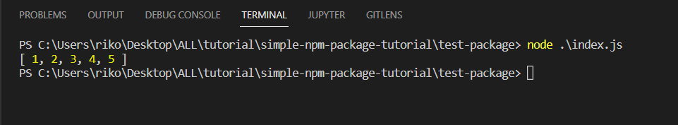

 **To Install**

    npm install distinct-array-function


**Basic Usage**

> 1. create node project using `npm init -y`
> 2. install this package using `npm install distinct-array-function` in terminal 
> 3. create index.js file in the folder project
> 4. run node index.js in your curent project

**Example**

```
const removeArrayDuplicate = require('distinct-array-function')

let myNums = [1,2,3,1,4,1,2,5,3,4]

let uniqueNums = removeArrayDuplicate(myNums)
console.log(uniqueNums)
```

**Screenshot Result**
